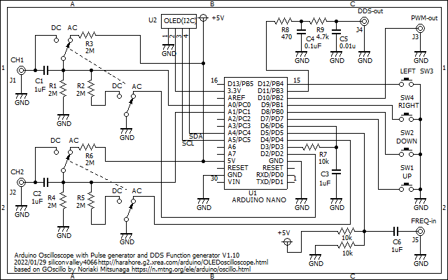

# Arduino Oscilloscope

Found this code in bits and pieces over the net, to build a teensy-weensy tiny Arduino-based Oscilloscope. It uses readily available components, for a screen, such as:

* SSD1306: 
* SH1106: 

## Libraries

It uses some libraries by Adafruit, please install them using the Arduino Library manager 

## Schematic

## Original Work

The [Code](https://n.mtng.org/ele/arduino/oscillo-j.html) for the Oscilloscope part is by M.Kurata Kyushu, on which [this](https://ss1.xrea.com/harahore.g2.xrea.com/arduino/OLEDoscilloscope.html) implementation is based.
